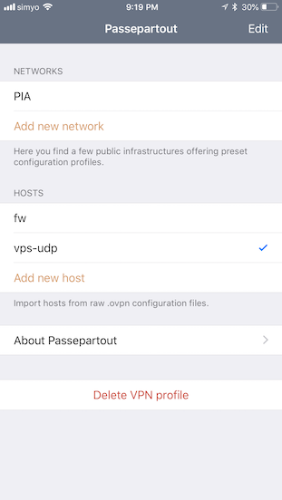
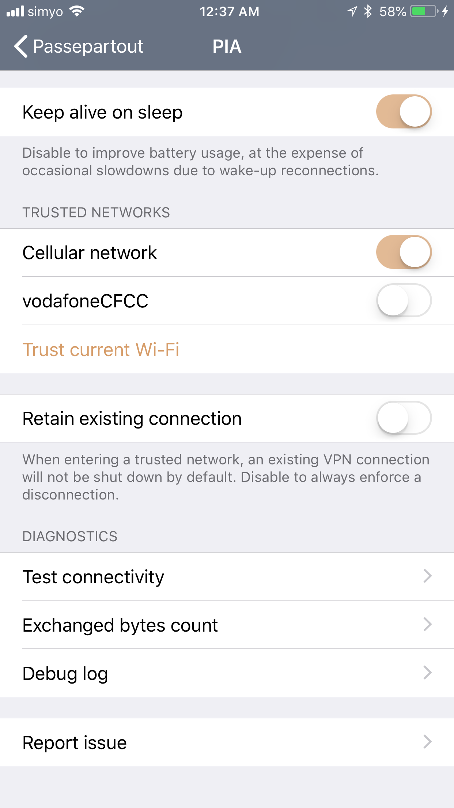
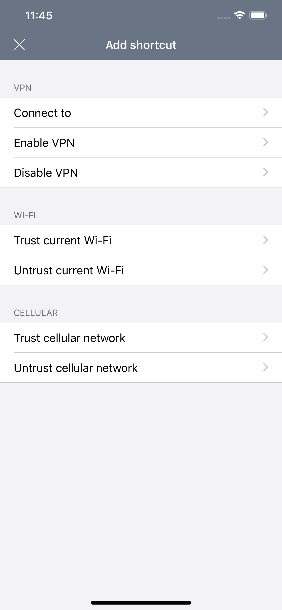
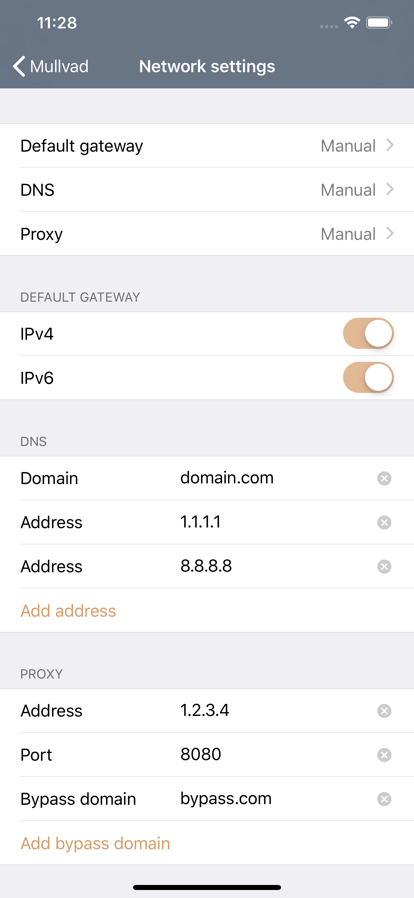
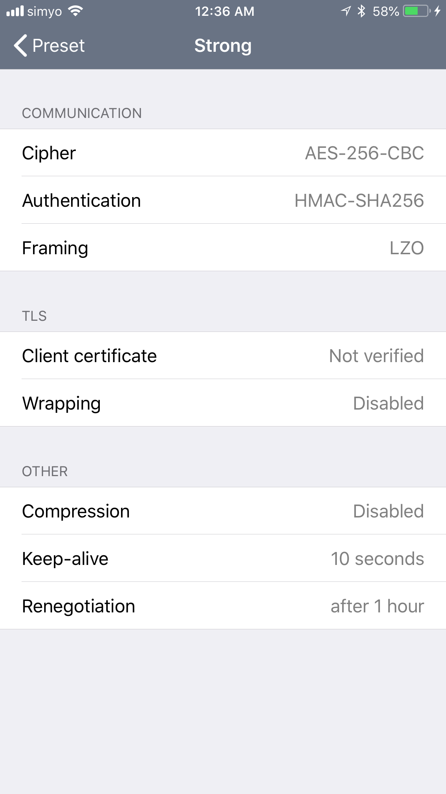

# [Passepartout][about-website]

[][dep-tunnelkit]

[][about-reddit]
[][about-telegram]

 
Passepartout is a non-official, user-friendly [OpenVPN®][openvpn] client for iOS.

## Overview

### All profiles in one place

Passepartout lets you handle multiple profiles in one single place and quickly switch between them.

### Ease of use

With its native look & feel, Passepartout focuses on ease of use. It does so by stripping the .ovpn flags that are today obsolete or rarely used. With good approximation, it mimics the most relevant features you will find in OpenVPN 2.4.x.

### Trusted networks

Trust cellular or Wi-Fi networks to fine-grain your connectivity. You can then choose to retain a VPN connection when entering a trusted network, or prevent it completely.

### Siri shortcuts

Enjoy the convenience of Siri shortcuts to automate frequent VPN actions.

### Override network settings

Override default gateway, DNS and proxy settings right from the app. Don't bother editing the .ovpn file or your pushed server settings. This is especially useful if you want to override your provider settings, e.g. to integrate your own DNS-based ad blocking.

### See your connection parameters

Passepartout strives for transparency, by showing a fairly detailed yet understandable resume of your connection parameters.

### Disconnect on sleep

Keeping the VPN active in the background provides smoother operation, but may be tough for the battery. You might want to use this feature if you're concerned about battery life. When the device goes to sleep, the VPN will disconnect to then reconnect on device wake-up.

### No unrequested activity

Passepartout is a VPN client and does absolutely nothing else without your consent. The providers infrastructures are obtained via a [static GitHub API][app-api] if and only if you manually refresh them.

### Presets for major providers

Passepartout can connect to a few well-known VPN providers with an existing account:

- [Mullvad][app-net-mullvad]
- [NordVPN][app-net-nordvpn]
- [Private Internet Access][app-net-pia]
- [ProtonVPN][app-net-protonvpn]
- [TunnelBear][app-net-tunnelbear]
- [VyprVPN][app-net-vyprvpn]
- [Windscribe][app-net-windscribe]

In preset mode, you can pick pre-resolved IPv4 endpoints when DNS is problematic.

### Import .ovpn profiles

Passepartout can import .ovpn configuration files. This way you can fine-tune encryption without tweaking and reimporting a new configuration. 

You can find details on what may or may not work in the related section of the [TunnelKit README][dep-tunnelkit-ovpn].

## Installation

### Requirements

- iOS 11.0+
- Xcode 11+ (Swift 5)
- Git (preinstalled with Xcode Command Line Tools)
- Ruby (preinstalled with macOS)
- [CocoaPods 1.8.0][dep-cocoapods]

It's highly recommended to use the Git and Ruby packages provided by [Homebrew][dep-brew].

### Testing

Download the app codebase locally:

    $ git clone https://github.com/passepartoutvpn/passepartout-ios.git

Enter the directory and clone the submodules:

    $ git submodule init
    $ git submodule update

Assuming you have a [working CocoaPods environment][dep-cocoapods], setting up the app workspace only requires installing the pod dependencies:

    $ pod install

For the VPN to work properly, the app requires:

- _App Groups_ and _Keychain Sharing_ capabilities
- App IDs with _Packet Tunnel_ entitlements

both in the main app and the tunnel extension target.

Make sure to update `Passepartout-iOS/Config.xcconfig` according to your developer account and your identifiers:

    CFG_TEAM_ID = A1B2C3D4E5
    CFG_APP_ID = com.example.ios.MyApp
    CFG_GROUP_ID = com.example.MyAppGroup // omit the "group." prefix
    CFG_APPSTORE_ID = 1234567890 // optional for development, can be bogus

After that, open `Passepartout.xcworkspace` in Xcode and run the `Passepartout-iOS` target.

## License

This project is licensed under the [GPLv3][license-content].

### Contributing

By contributing to this project you are agreeing to the terms stated in the [Contributor License Agreement (CLA)][contrib-cla]. For more details please see [CONTRIBUTING][contrib-readme].

## Credits

The logo is taken from the awesome Circle Icons set by Nick Roach.

The country flags are taken from: <https://github.com/lipis/flag-icon-css/>

- Kvitto - © 2015 Oliver Drobnik
- lzo - © 1996-2017 Markus F.X.J. Oberhumer
- MBProgressHUD - © 2009-2016 Matej Bukovinski
- PIATunnel - © 2018-Present Private Internet Access
- SSZipArchive - © 2010-2012 Sam Soffes
- SwiftGen - © 2018 SwiftGen
- SwiftyBeaver - © 2015 Sebastian Kreutzberger

This product includes software developed by the OpenSSL Project for use in the OpenSSL Toolkit. ([https://www.openssl.org/][dep-openssl])

© 2002-2018 OpenVPN Inc. - OpenVPN is a registered trademark of OpenVPN Inc.

## Translations

- Chinese (Simplified): OnlyThen - [@OnlyThen](https://github.com/OnlyThen)
- Dutch: Norbert de Vreede - [@paxpacis](https://github.com/paxpacis)
- English: Davide De Rosa (author)
- French: Julien Laniel - [@linkjul](https://github.com/linkjul)
- German: Christian Lederer, Theodor Tietze
- Greek: Konstantinos Koukoulakis
- Italian: Davide De Rosa (author)
- Polish: Piotr Książek
- Portuguese: Helder Santana - [@heldr](https://github.com/heldr)
- Russian: Alexander Korobynikov
- Spanish: Davide De Rosa (author), Elena Vivó
- Swedish: Henry Gross-Hellsen - [@cowpod](https://github.com/cowpod)

## Usage

You are strongly encouraged to read carefully both the [disclaimer][web-disclaimer] and [privacy policy][web-privacy] before using this software.

## Contacts

Twitter: [@keeshux][about-twitter]

Website: [passepartoutvpn.app][about-website]

[openvpn]: https://openvpn.net/index.php/open-source/overview.html

[app-api]: https://github.com/passepartoutvpn/passepartout-api
[app-net-mullvad]: https://mullvad.net/en/account/create/
[app-net-nordvpn]: https://go.nordvpn.net/SH21Z
[app-net-pia]: https://www.privateinternetaccess.com/pages/buy-vpn/
[app-net-protonvpn]: https://proton.go2cloud.org/SHZ
[app-net-tunnelbear]: https://www.tunnelbear.com/
[app-net-vyprvpn]: https://www.vyprvpn.com/
[app-net-windscribe]: https://secure.link/kCsD0prd

[dep-cocoapods]: https://guides.cocoapods.org/using/getting-started.html
[dep-brew]: https://brew.sh/
[dep-tunnelkit]: https://github.com/passepartoutvpn/tunnelkit
[dep-tunnelkit-ovpn]: https://github.com/passepartoutvpn/tunnelkit#support-for-ovpn-configuration
[dep-openssl]: https://www.openssl.org/

[license-content]: LICENSE
[contrib-cla]: CLA.rst
[contrib-readme]: CONTRIBUTING.md

[web-disclaimer]: https://passepartoutvpn.app/disclaimer/
[web-privacy]: https://passepartoutvpn.app/privacy/

[about-twitter]: https://twitter.com/keeshux
[about-website]: https://passepartoutvpn.app
[about-patreon]: https://www.patreon.com/keeshux
[about-reddit]: https://www.reddit.com/r/passepartout
[about-telegram]: https://t.me/passepartoutvpn
